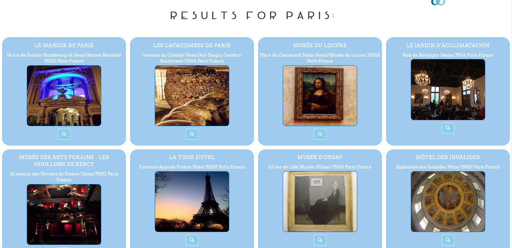
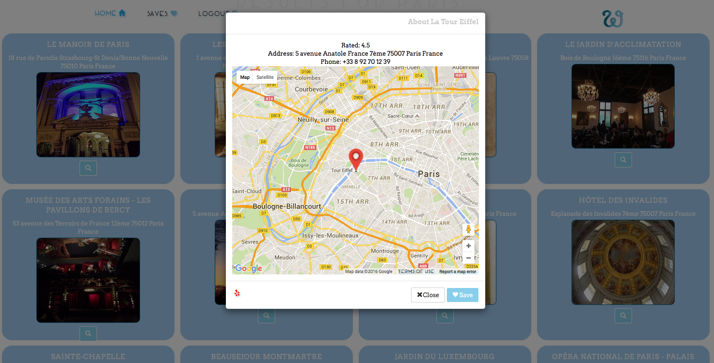
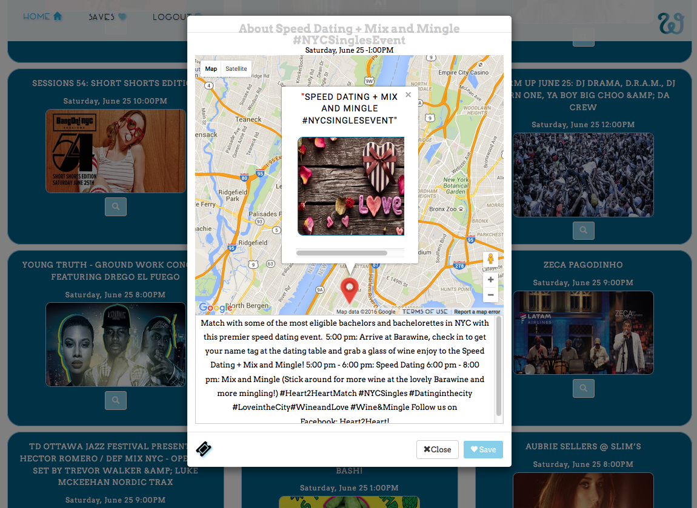
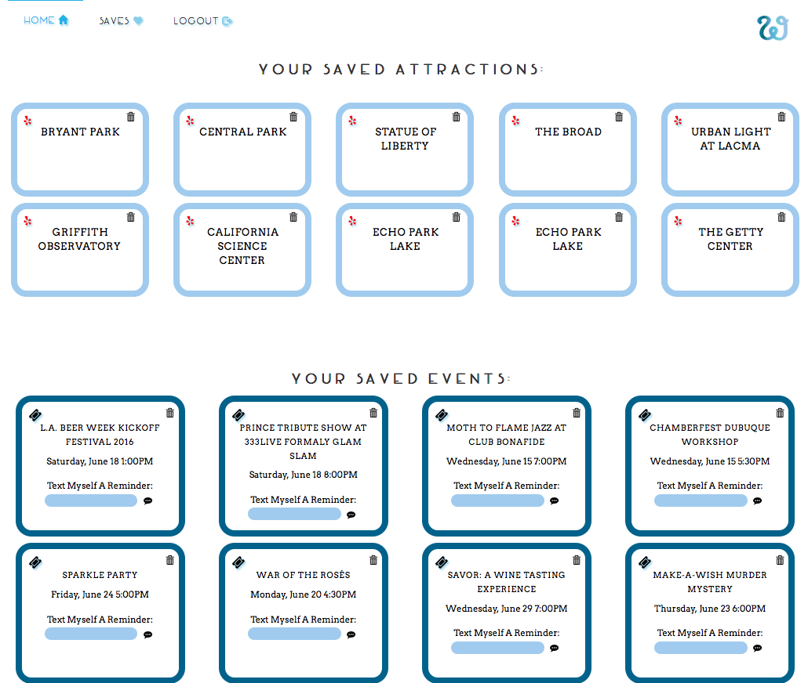

*Wanderful* is a fullstack web application that makes planning vacations, trips and adventures more fun and less time consuming. Users search by location and date, and the app curates local listings of the highest rated attractions for the given location, and events for that date that are within close proximity to that location. Each search result includes details and direct links to the specific Yelp and Eventbrite ticketing pages. Without navigating to an external page, each result includes the option to open a map rendered in a modal window to eliminate the need to open tab after tab while scanning the results. *Wanderful* helps users avoid the endless loop of re-saving and re-finding travel information, since they can save search results to their agenda to view later. Users can send themselves SMS reminders about upcoming saved events so they always know what they have planned even when they're on the go. *Wanderful* helps users save time by providing a one stop place to find, save and be reminded of all of the adventures they want to go on. 

Integration of the Yelp API and Eventbrite API allows users to browse attractions and events happening across the globe in real time. Wanderful uses Google Maps API to show a map of each location dynamically. PostgreSQL and SQLAlchemy store saved search results to be viewable by the user anytime. SMS text reminders for any saved event can be sent from the application via the Twilio API. Users can view their personal calendar that dynamically renders their saved events with Javascript.

#### Technical Stack
-  Python
-  Flask
- Javascript/jQuery
- PostgreSQL
- SQLAlchemy
- AJAX/JSON
- Jinja2
- Bootstrap
- Yelp API
- Eventbrite API
- Google Maps API
- Twilio API

### Features
- User registration and login (PSQL/SQLAlchemy)
- Flask app renders HTML and handles AJAX requests to the database
- Search by location and date (Yelp/Eventbrite)
- Modal windows provide details for each result (Google Maps/Yelp/Eventbrite)
- Saved events are dynamically rendered on a Javascript calendar 
- Built-in Twilio implementation

Users login and enter a search location and a date.

The results page features the top results returned after querying the Yelp and Eventbrite API's with the search term and date.

Each result features a modal window rendering a location with the Google Maps API. Users can link directly to the attraction page on Yelp. Attractions can be saved to the users database.

Similar to the modal for Yelp, each event details modal features a google map as well as a short description of the event and a link to the ticketing page on Eventbrite. 

The user's agenda is a single page view of all of the saved attractions and events. The twilio API gives users the option to send themselves text reminders about upcoming saved events, or invite friends. 

A dynamic Javascript calender renders the user's saved events in real time. 

### Version 2.0:
- Mobile Friendly
- Facebook login/integration with Facebook events
- Add API's & web scrape for more data on travel information to provide the user with a more cohesive travel planning application (Tripadvisor, etc)
- Chrome extension, drag and drop links from external pages to be saved in the user's agenda
- Seperate "trips" in agenda for more organization for the user
- Functionality that allows the user to make notes about what they liked/disliked
- Social sharing (facebook, twitter, etc)

Contact Information: 
    [Linkedin](https://www.linkedin.com/in/veronica-erick-955b7373)
    ---
    [Email](veronicaeerick@gmail.com)

